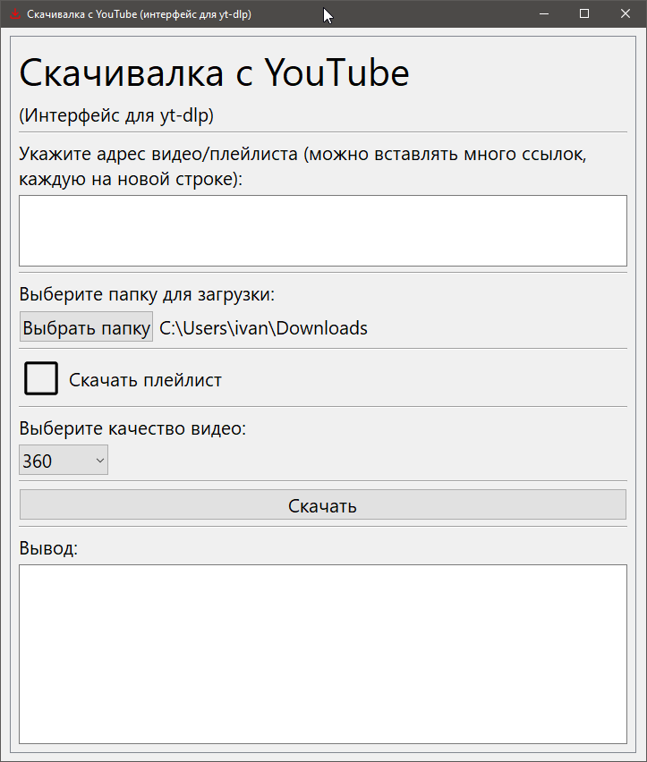

# Yt-dlp python GUI 1.0.1



GUI для yt-dlp на Python + PySide6.

## Внимание!

Ни в коем случае не используйте данное приложение в корыстных целях. Автор не несёт никакой ответственности за ваши действия!

TL;DR: я не я, корова не моя :)

## Сборка

```bash
python -m venv .venv
.venv/Scripts/Activate.ps1
pip install -r requirements.txt

pyinstaller --clean -n "yt-dlp-python-gui" -w -y -F -i="ui\icon.ico" --add-data="ui\icon.ico:ui" .\main.py
```

## Linux

Нужно поправить алгоритм поиска папки загрузки. Остальное всё кроссплатформенное.
