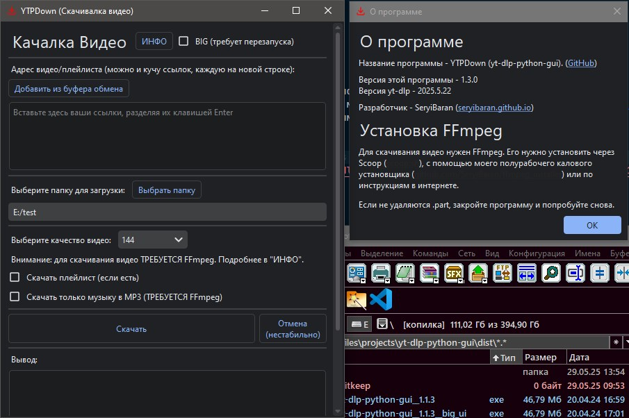

# Yt-dlp python GUI



GUI для yt-dlp на Python + PySide6.

## Внимание!

1. Ни в коем случае не используйте данное приложение в корыстных целях. Автор не несёт никакой ответственности за ваши действия!
2. Для скачивания видео ТРЕБУЕТСЯ FFmpeg. Его можно установить через [Scoop](https://scoop.sh), с помощью [моего полурабочего установщика](https://github.com/SeryiBaran/ffmpeg_installer) или по инструкциям в интернете.

## Скачать (Windows)

- [Скачать](https://github.com/SeryiBaran/yt-dlp-python-gui/releases/latest/download/yt-dlp-python-gui__1.2.4__2025.5.22.exe)

## Сборка (PowerShell+UV)

```powershell
uv sync

pyside6-uic .\ui\main.ui -o .\ui_main.py && pyside6-uic .\ui\about.ui -o .\ui_about.py
$versions = Get-Content .\versions.json -Raw | ConvertFrom-Json

pyinstaller --clean -n "yt-dlp-python-gui__$($versions.app)__$($versions.yt_dlp)" -w -y -F -i="ui\icon.ico" --add-data="ui\icon.ico:ui" --add-data="versions.json:." .\main.py
```

## Разработка

- Чтобы изменить версию, надо отредактировать её в `versions.json`, `pyproject.toml` и здесь в `README.md`

## Linux

Нужно поправить алгоритм поиска папки загрузки `download_directory`. Остальное всё кроссплатформенное.
